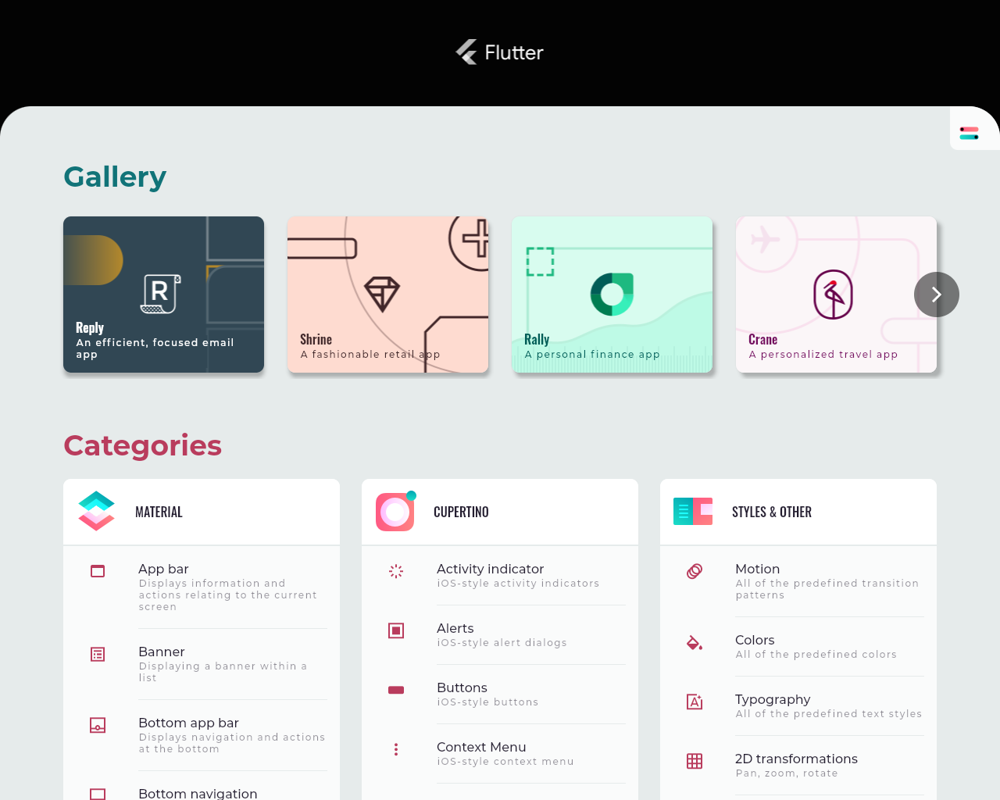

# Flutter Wayland

A Flutter Embedder that talks to Wayland

** ARCHIVED REPO **

I recommend use of https://github.com/toyota-connected/ivi-homescreen/ which is re-write of this proof of concept app.



#### Build Setup Instructions

* Ubuntu 18/20 deps: `sudo apt-get install cmake lib-wayland++ libgl1-mesa-dev libegl1-mesa-dev libgles2-mesa-dev libxkbcommon-dev rapidjson-dev clang`
* Fedora 33/34 deps: `sudo dnf install wayland-devel libxkbcommon-devel rapidjson-devel pugixml-devel waylandpp-devel clang`

```
mkdir build && cd build
CXX=/usr/bin/clang++ CC=/usr/bin/clang cmake ..
make -j VERBOSE=1
```

#### Enable Wayland on Ubuntu 16/18

* log out
* select gear icon
* select `Ubuntu on Wayland`
* login as usual

## Running Flutter Application

```
Flutter Wayland Embedder

========================
Usage: `flutter_wayland <asset_path> <flutter_flags>`


This utility runs an instance of a Flutter application and renders using
Wayland core protocols.

The Flutter tools can be obtained at https://flutter.io/

app_path:      This either points to asset bundle path, or
               an Ahead Of Time (AOT) shared library (.so).

asset_path:    The Flutter application code needs to be snapshotted using
               the Flutter tools and the assets packaged in the appropriate
               location. This can be done for any Flutter application by
               running `flutter build bundle` while in the directory of a
               valid Flutter project. This should package all the code and
               assets in the "build/flutter_assets" directory. Specify this
               directory as the first argument to this utility.

flutter_flags: Typically empty. These extra flags are passed directly to the
               Flutter engine. To see all supported flags, run
               `flutter_tester --help` using the test binary included in the
               Flutter tools.
```

#### Building Gallery Application
```
cd ~/development
export PATH=`pwd`/flutter/bin:$PATH
flutter doctor -v
git clone https://github.com/flutter/gallery.git
cd gallery
flutter channel dev
flutter upgrade
flutter build bundle
```
#### Running Gallery Application
```
cd flutter_wayland/build
cp ~/development/flutter/bin/cache/artifacts/engine/linux-x64/icudtl.dat .
./flutter_wayland /home/joel/development/gallery/build/flutter_assets
```
Note: the flutter engine and gallery channel must match, or you will see something like this:

```
[ERROR:flutter/shell/common/shell.cc(103)] Dart Error: Can't load Kernel binary: Invalid SDK hash.
[ERROR:flutter/runtime/dart_isolate.cc(171)] Could not prepare isolate.
[ERROR:flutter/runtime/runtime_controller.cc(415)] Could not create root isolate.
[ERROR:flutter/shell/common/shell.cc(588)] Could not launch engine with configuration.
```

A run without errors might look like this:

```
$ ./flutter_wayland /home/joel/development/gallery/build/flutter_assets
LOG: /mnt/raid10/flutter_wayland/src/main.cc:65: Arg: /home/joel/development/gallery/build/flutter_assets
Pointer Present
Keyboard Present
assets_path: /home/joel/development/gallery/build/flutter_assets
load_aot: 0
flutter: Observatory listening on http://127.0.0.1:36061/E9T-fNgSjiU=/
LOG: /mnt/raid10/flutter_wayland/src/platform_channel.cc:108: PlatformChannel: SystemChrome.setApplicationSwitcherDescription
```
